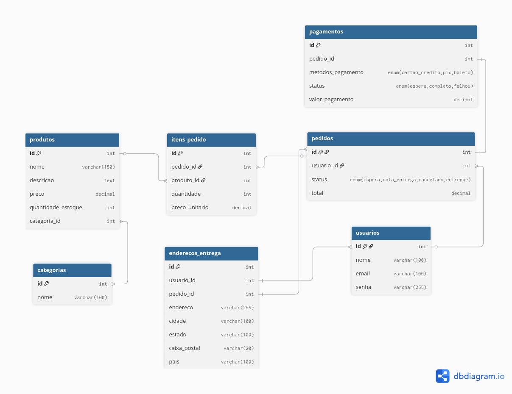

# API Loja Virtual


API REST para gerenciamento de uma loja virtual, com controle completo das entidades de **Categorias**, **Produtos**, **Usuários**, **Endereços de Entrega**, **Pagamentos** e **Pedidos**.

## Sumário
- [Tecnologias Utilizadas](#tecnologias-utilizadas)
- [Arquitetura](#arquitetura)
- [Pré-requisitos](#pré-requisitos)
- [Instalação](#instalação)
- [Configuração](#configuração)
- [Execução](#execução)
- [Endpoints](#endpoints)
- [Requisições de Attach e Detach](#requisições-de-attach-e-detach)
- [Contribuindo](#contribuindo)
- [Autores](#autores)

## Tecnologias Utilizadas
- **Linguagem:** TypeScript
- **Framework:** AdonisJS
- **Banco de Dados:** PostgreSQL
- **Containerização:** Docker e Docker Compose

## Arquitetura
</img>

## Pré-requisitos
Certifique-se que você tem instalado:
- [Node.js](https://nodejs.org/pt)
- [Docker](https://www.docker.com/)
- npm ou yarn
- Git

## Instalação
```bash
# Clone o repositório
git clone https://github.com/Barr0ca/projeto_final_ordex.git

# Entre no diretório
cd projeto_final_ordex

# Instale as dependências
npm install
```

## Configuração
Crie um arquivo `.env` na raiz do projeto com as variáveis:

```bash
TZ=UTC
PORT=3333
HOST=localhost
LOG_LEVEL=info
APP_KEY=
NODE_ENV=development
DB_HOST=127.0.0.1
DB_PORT=5000
DB_USER=nome_do_usuario_db
DB_PASSWORD=senha_db
DB_DATABASE=nome_do_banco_de_dados
```
O arquivo `.env.example` contém um modelo para facilitar.

## Execução
Antes de executar a API, certifique-se que o arquivo `docker-compose.yaml` já está rodando.

```bash
# Executar o docker-compose.yaml em segundo plano
docker compose up -d

# Parar o docker-compose.yaml
docker compose down
```

Após a inicialização do `docker-compose.yaml`, execute:
```bash
# Rodar o projeto
npm run dev
```

A aplicação irá rodar em:
```bash
# Rota da aplicação
http://localhost:3333
```

## Endpoints
- ### Categorias:

  | Métodos | Endpoints | Descrição |
  | - | - | - |
  | GET | `/categoria` | Lista todas as categorias |
  | GET | `/categoria/:id` | Lista uma categoria através do ID |
  | POST | `/categoria` | Cria uma categoria |
  | POST | `/categoria/:id/associar-produto` | Associa produtos a uma categoria |
  | POST | `/categoria/:id/desassociar-produto` | Desassocia produtos de uma categoria |
  | PUT | `/categoria/:id` | Atualiza uma categoria |
  | DELETE | `/categoria/:id` | Remove uma categoria |

- ### Produtos:

  | Métodos | Endpoints | Descrição |
  | - | - | - |
  | GET | `/produto` | Lista todos os produtos |
  | GET | `/produto/:id` | Lista um produto através do ID |
  | POST | `/produto` | Cria um produto |
  | PUT | `/produto/:id` | Atualiza um produto |
  | DELETE | `/produto/:id` | Remove um produto |

- ### Pedidos:

  | Métodos | Endpoints | Descrição |
  | - | - | - |
  | GET | `/pedido` | Lista todos os pedidos |
  | GET | `/pedido/:id` | Lista um pedido através do ID |
  | POST | `/pedido` | Cria um pedido |
  | POST | `/pedido/:id/adicionar-pedido` | Adiciona produto a um pedido |
  | POST | `/pedido/:id/retirar-pedido` | Retira produto de um pedido |
  | PUT | `/pedido/:id` | Atualiza um pedido |
  | DELETE | `/pedido/:id` | Remove um pedido |

- ### Pagamentos:

  | Métodos | Endpoints | Descrição |
  | - | - | - |
  | GET | `/pagamento` | Lista todos os pagamentos |
  | GET | `/pagamento/:id` | Lista um pagamento através do ID |
  | POST | `/pagamento` | Cria um pagamento |
  | PUT | `/pagamento/:id` | Atualiza um pagamento |
  | DELETE | `/pagamento/:id` | Remove um pagamento |

- ### Usuários:

  | Métodos | Endpoints | Descrição |
  | - | - | - |
  | GET | `/usuario` | Lista todos os usuários |
  | GET | `/usuario/:id` | Lista um usuário através do ID |
  | POST | `/usuario` | Cria um usuário |
  | PUT | `/usuario/:id` | Atualiza um usuário |
  | DELETE | `/usuario/:id` | Remove um usuário |

- ### Endereços Entrega:

  | Métodos | Endpoints | Descrição |
  | - | - | - |
  | GET | `/endereco-entrega` | Lista todos os endereços de entrega |
  | GET | `/endereco-entrega/:id` | Lista um endereço de entrega através do ID |
  | POST | `/endereco-entrega` | Cria um endereço de entrega |
  | PUT | `/endereco-entrega/:id` | Atualiza um endereço de entrega |
  | DELETE | `/endereco-entrega/:id` | Remove um endereço de entrega |

## Requisições de Attach e Detach
A seguir está um exemplo de como utilizar as rotas que utilizam os métodos de `attach` e `detach` no gerenciamento de relacionamentos **many-to-many**.

- ### Categorias

  **Endpoint:** `/categoria/:id/associar-produto`
    
    Attach:
    ```bash
    {
      "produto": [] # Lista com id's dos produtos que serão associados a categoria
    } 
    ```
  ---
  **Endpoint:** `/categoria/:id/desassociar-produto`

    Detach:
    ```bash
    {
      "produto": [] # Lista com id's dos produtos que serão desassociados da categoria
    } 
    ```

- ### Pedidos

  **Endpoint:** `/pedido/:id/adicionar-pedido`
    
    Attach:
    ```bash
    {
      "produto": {
        # ID do produto
        "id": {
          "quantidade": 0, # Quantidade do produto
          "preco_unitario": 0 # Valor unitário do produto
        }
      }
    }
    ```
  ---
  **Endpoint:** `/pedido/:id/retirar-pedido`

    Detach:
    ```bash
    {
      "produto": {
        # ID do produto
        "id": {}
      }
    }
    ```

## Contribuindo
1. Faça um fork do projeto;
2. Crie uma branch (`git checkout -b minha-feature`);
3. Commit suas mudanças (`git commit -m 'Adiciona minha feature'`);
4. Envie para o repositório (`git push origin minha-feature`);
5. Abra um Pull Request.

## Autores
| [<br><sub>Ian Galvão</sub>](https://github.com/Barr0ca) |  [<br><sub>Jardson Alan</sub>](https://github.com/jardsonalan) |  [<br><sub>Lucas Dantas</sub>](https://github.com/uluscaz-ifrn) |
| :---: | :---: | :---: |
